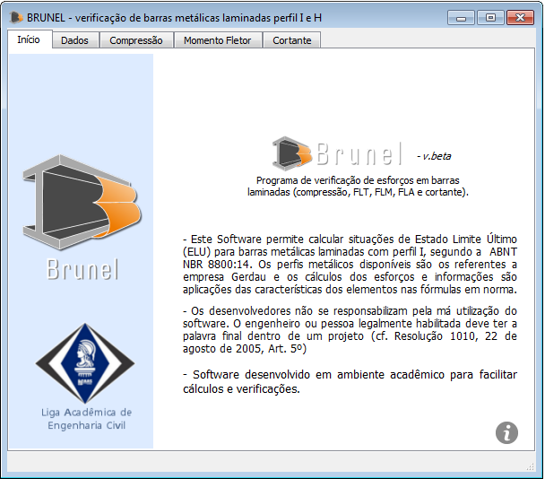
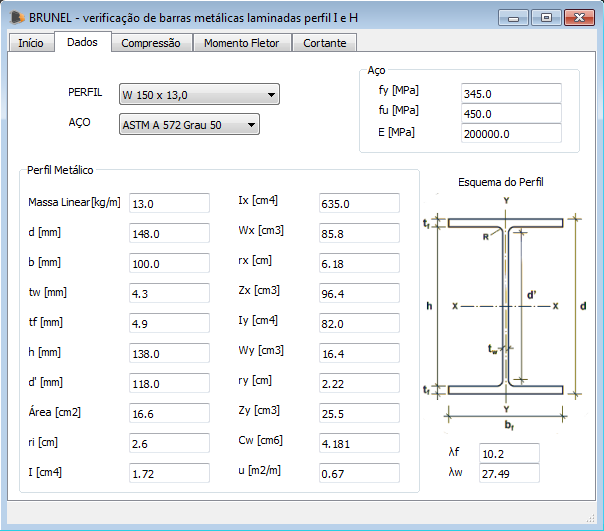
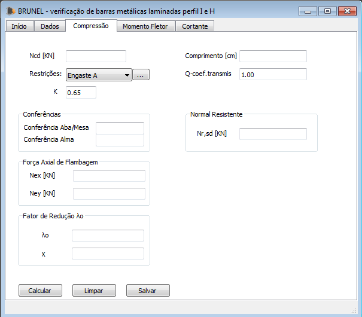
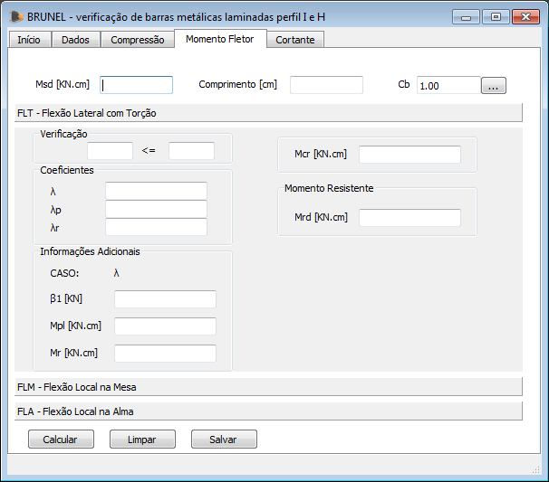
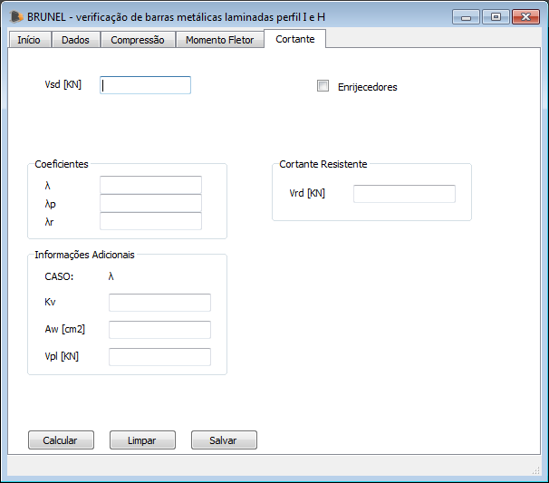

# Brunel
Software voltado para Engenharia Civil capaz de realizar verificação de barras metálicas laminadas perfil I e H aos estudos das principais condições de esforços.




## Instalação

OS X & Linux:

```sh
1 - Download dos arquivos
      https://github.com/Anderson3/Brunel/archive/master.zip
    
2 - Descompacte-os e instale as bibliotecas necessárias para execução
      pip install requirements.txt  
      
3 - Execute o código do Brunel em Python
      python Brunel.py
```

Windows:

```sh
1 - Download do arquivo execultável em um arquivo [onefile]
      https://github.com/Anderson3/Brunel/raw/master/Brunel.exe

ou

1 - Download do arquivo execultável com diretórios [dir]
      https://github.com/Anderson3/Brunel/raw/master/Brunel.exe

```

## Funcionamento da aplação

Na aba "Dados" devem ser definidos os tipos de perfil metálico usado em estudo, bem como também as propriedades mecânicas relacionadas. O Brunel apresenta opções de todos os tipos de perfis metálicos da Gerdau e propriedades usuais. Para cada tipo de perfil são carregados todas as informações inerentes e necessárias para cálculo. Sendo que o perfil escolhido nessa seção será o utilizado para calcular todos os casos de solicitação.
<p align="center">

</p>

Na aba "Compressão" é realizado o cálculo de resistência compressiva do material metálico, tomando como valores extras de entradas a força normal de projeto [Ncd], tipo de restrição dos apoios nas extremidades da barra [k], coeficiente de transmissão e o comprimento do elemento linear [l] O Brunel verifica se as condições 'passam' para a seção metálica e situações definidas.
<p align="center">
 
</p>

Na aba "Momento Fletor" são testadas as condições de barras metálicas para as 3 situações que envolvem Flexão Lateral à Torção (FLT), Flexão Local na Mesa (FLM) e Flexão Local na Alma (FLA). Os dados requeridos que constam para a realização das verificações dos três estados são: o momento fletor de projeto [Md], comprimento da barra [l] e o fator de modificação [Cb], sendo esse último devendo ser previamente cálculado baseado na NBR 8800:08. Após o processamento dos dados todas as condições limites para o momento são calculadas e retornados informações, dados e situação de resistência a esse tipo de esforço.
<p align="center">

</p>

Na aba "Cortante" a barra é calculada para o esforço de cisamento, sendo necessários os dados da força cortante de projeto [Vd] e a existência de enrijecedores utilizados para melhoramento resistivo, para o caso da ocorrência de enrijecedores o Brunel requerirá a distância adotada entre os mesmo para contabilização de cálculo. Ao final a barra é testada para o esforço cortante.
<p align="center">

</p>
 

## Exemplo de utilização

## Meta

Anderson Alves de Aguiar – [@Andersonmath97](https://twitter.com/@Andersonmath97) – andersonalvesmath@hotmail.com

[https://github.com/Anderson3/Brunel](https://github.com/Anderson3/Brunel)

